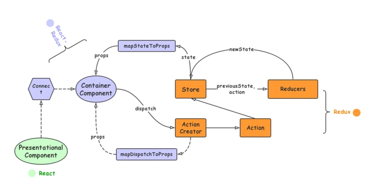
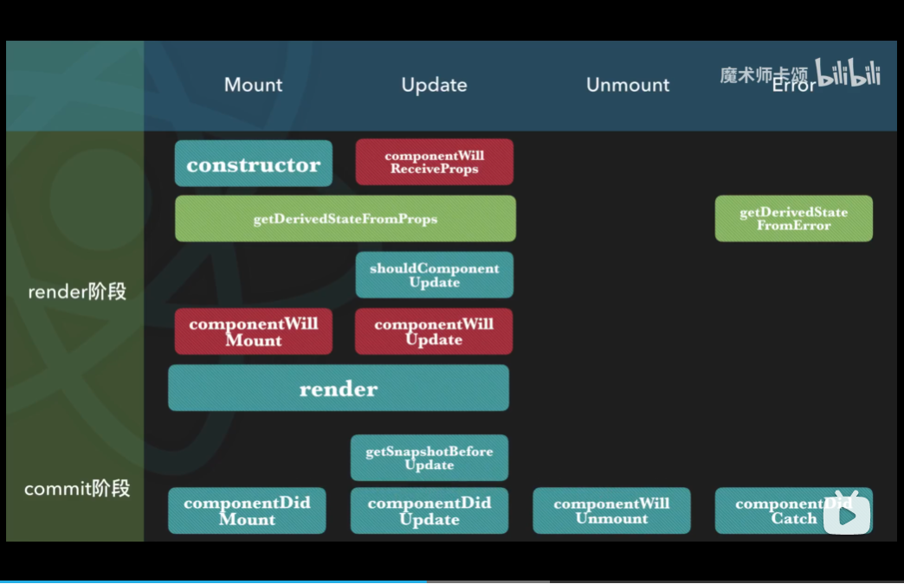
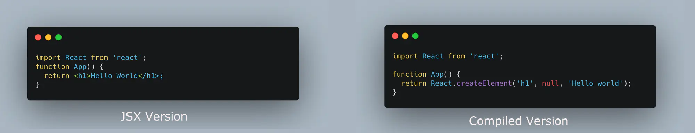
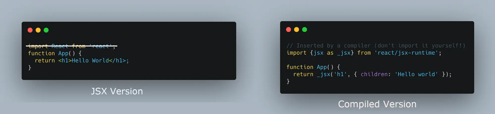
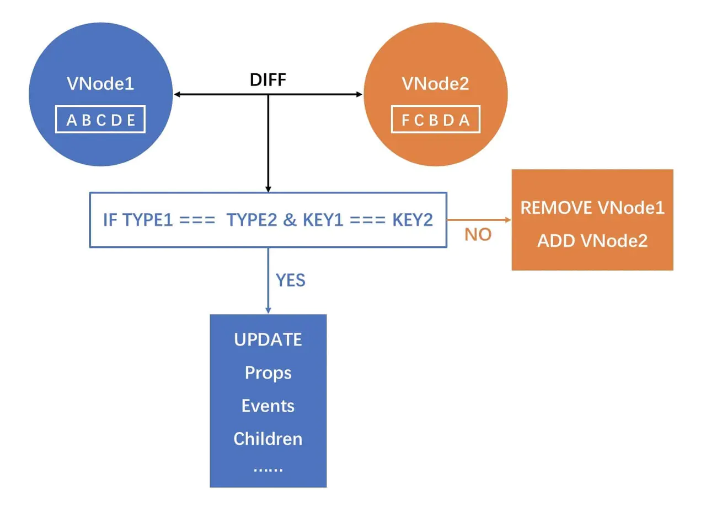
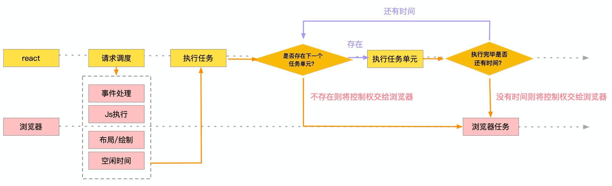
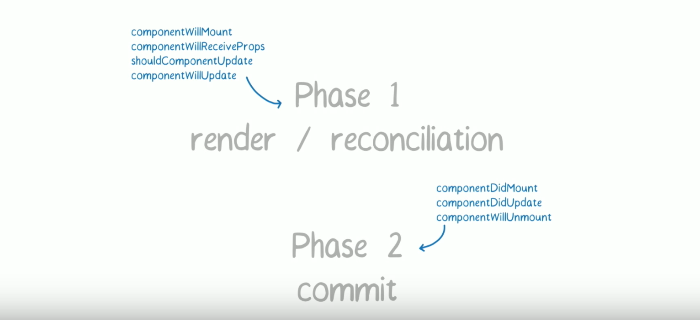
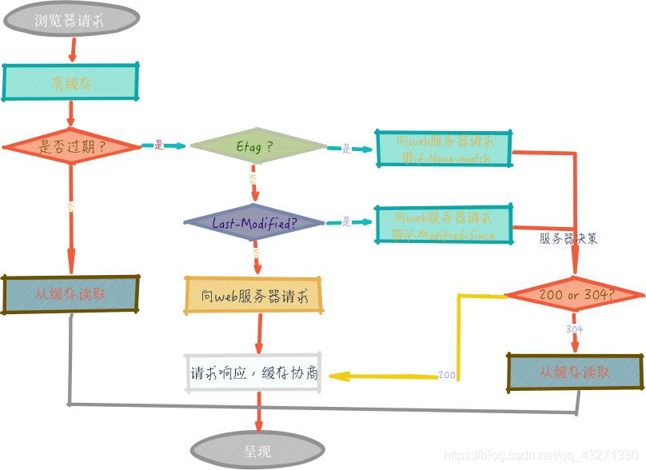
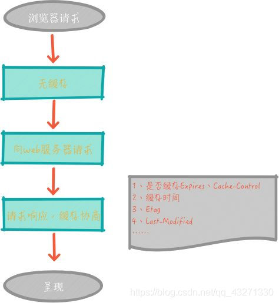

# 一、CSS 面试题

## ✅Flex 布局中常用的属性有哪些？

- flex-direction：主轴的方向
- flex-wrap：换行的方式
- justify-content：项目在主轴上的对齐方式
- align-items：项目在交叉轴上的对齐方式
- align-self：单个项目有与其他项目不一样的对齐方式

# 二、JS 面试题

## ✅ 什么是原型链？

一个实例对象，在读取属性或方法时，会依次从实例本身 -> 构造函数原型 -> 构造函数原型的原型，一直找到 Object.prototype 为止，这个查找路径即原型链。

## ✅ 什么是 Event Loop？

1. Event Loop 即事件循环，是指浏览器或 Node 的一种解决 JS 单线程运行时不会阻塞的一种机制。
2. Event Loop 的执行顺序是从调用栈 -> 微任务队列 -> 消息队列。

## ✅ 箭头函数和普通函数有什么区别？

- 箭头函数没有 arguments
- 箭头函数没有 this
- 箭头函数没有原型
- 箭头函数不能作为构造函数

## ✅ Async 的实现原理是什么？

Async 本质上是 Generator 的语法糖。

因此基于 Generator 实现以下两点即可：

- Async 自带执行器，而 Generator 函数需要手动 next。
- Async 函数返回值是 Promise 对象，而 Generator 函数返回的是生成器对象。

## ✅ JS 异步解决方案的发展历程中各自都有哪些优缺点？

为什么需要异步？JS 的单线程存在同步阻塞问题。

1. 回调函数的优缺点：回调函数的优点是解决了同步阻塞，缺点是会引发嵌套地狱。
2. Promise 的优缺点：Promise 的优点是通过链式调用解决了横向嵌套地狱，缺点是内部流程不可控，例如无法取消。
3. Generator 的优缺点：Generator 的优点是通过手动挡实现了流程可控，缺点是使用流程过于繁琐，但可以使用 co 解决。
4. Async 的优缺点：Async 本质上是 Generator 的语法糖，优点是代码上更简洁优雅，缺点是错误处理只能依赖外部的 try...catch...。

## ✅ JS 中定时器的时间间隔意味着什么？

定时器到达时间并非立即执行回调函数，而是先加入消息队列，等待调用栈和微任务队列都为空后调用。

# 三、React 面试题

## ✅ 什么是 React？

React 是一个网页 UI 框架，通过组件化的方式解决视图层开发复用的问题，本质是一个组件化框架。它的核心设计思路有三点，分别是声明式、组件化与通用性。

React 的优缺点：React 的优点是跨平台能力出众，缺点是没有提供完整的解决方案，遇到复杂问题只能依赖社区。

## ✅ React 中类组件和函数组件有哪些区别？

- 代码性能：由于类组件需要实例化，而函数组件不需要，因此使用函数组件性能会优于类组件。
- 组件特性：类组件由于实例化会具备 this、 state 和生命周期的特性，而函数组件只能通过 Hooks 来增强组件特性。
- 逻辑复用：大量的生命周期使得类组件难以拆解复用，而函数组件可以通过 Hooks 灵活复用组件。
- 状态捕获：函数组件基于闭包特性捕获渲染时的值，而类组件基于 this 会导致特定场景下的状态丢失。

## ✅ React 从 Mixin 到 HOC 再到 Hooks 的发展历程中各自都有哪些优缺点？

Mixin 的缺点：

- 依赖混乱：不同的 Mixin 之间存在隐式依赖，不利于维护和理解。
- 命名冲突：不同的 Mixin 之间存在命名空间的冲突。

HOC 相比 Mixin 的优点：

- 层级分明：HOC 拥有天然的组件层级关系。
- 功能强大：HOC 通过属性代理、反向继承等控制组件。

HOC 的缺点：

- 嵌套地狱：带来 DOM 嵌套和调试困难等问题。
- 不可见性：对于内部组件而言外层组件如同黑盒。

Hooks 相比 HOC 的优点：

- 代码简洁：Hooks 解决了 HOC 的嵌套问题，更加简洁。
- 函数友好：Hooks 为函数组件而生，间接解决了类组件的 this 指向、组件复用等问题。

Hooks 的缺点

- 闭包陷阱：操作不当可能会引用到旧的 state、props 值。
- 成本较大：重构成本与学习成本较大。

## ✅ 谈一谈 Redux 的数据流？



1. 用户通过事件，dispatch 发出 action。
2. store 自动调用 reducer，并且传入两个参数：当前 state 和收到的 action，reducer 会返回新的 state。
3. state 一旦有变化，store 就会调用监听函数并重新渲染视图。

## ✅ React 中 setState 是同步还是异步？

- 传统模式下命中批量更新时异步，未命中批量更新时同步。
- 并发模式下都是同步。

## ✅ 谈一谈 React 的生命周期？

可以从以下两个维度划分：

- 按渲染阶段：分为 render、commit 两个阶段。render 阶段负责计算状态，commit 阶段负责将状态变化渲染到视图中。
- 按组件状态：分为 Mount、Update、Unmount、Error 4 种状态。

React 生命周期图示：



## ✅ React 中实现组件通信有哪些方法？

- 父传子：props
- 子传父：props + 回调函数
- 兄弟：状态提升
- 通用方案：useContext、Redux

## ✅ React 合成事件的实现原理是什么？

DOM 层通过事件冒泡机制将事件委托给 document，合成事件层通过 SyntheticEvent 包装器实例化成统一的 ReactEvent，最后再分发给事件处理函数执行。

> React 中合成事件和虚拟 DOM 都是通过中间层解决框架跨平台问题的方案。

## ✅ Redux 与 Mobx 有哪些区别？

不可变性：Redux 不可以直接修改状态，但 Mobx 可以。
设计思想：Redux 属于函数式编程， Mobx 属于面向对象编程。
异步实现：Redux 通过中间件实现异步，Mobx 直接 Async/Await。

## ✅ useEffect(fn,[]) 和 componentDidMount 有哪些区别？

useEffect(fn,[]) 会在 commit 阶段完成后异步调用，componentDidMount 会在 commit 阶段的 layout 子阶段中同步调用。

与 componentDidMount 效果完全一致的 Hook 是 useLayoutEffect(fn,[])。

## ✅ React 中有哪些性能优化方案？

- shouldComponentUpdate、PureComponent、memo
- useMemo、useCallback
- immutable
- key

## ✅ 什么是 JSX？

JSX 是一种类 HTML 动态标签语法，作用是为了能更便捷地使用 JS 构建 UI，其本质是 React.createElement() 的语法糖。



React 17 新特性：React 17 版本中使用 JSX 已经不需要手动导入 React。



## ✅ 什么是虚拟 DOM？

虚拟 DOM 是 JS 对象对真实 DOM 的抽象。

虚拟 DOM 的优缺点：优点提升了框架的跨平台能力，缺点是性能上限会变低。


> React.createElement 会将 JSX 转换为 虚拟 DOM。

## ✅ 谈一谈 Diff 算法？

传统 Diff 算法：时间复杂度是`O(n^3)`。

**React 中 Diff 算法的策略**

1. 同层比对策略

因为在实际开发中改变一个节点的从属关系的情况是很少的，所以 React 只做同层级的比对，忽略跨层级的比对。

时间复杂度：从`O(n^3)`优化至`O(n^2)`

2. 唯一标识策略

因为同层级比对伴随着很多新增删除操作，所以 React 引入 key 作为节点的唯一标识用于复用组件。

时间复杂度：从`O(n^2)`优化至`O(n)`

3. 组件模式策略

因为 Diff 算法需要从根节点开始，逐层遍历以确定目标节点，所以 React 推荐组件化开发用于缩小上述查找过程。

**React 中 Diff 算法的实现原理**

对于新旧节点是非同类型节点时，直接创建新节点再替换旧节点。

对于新旧节点是同类型节点时，在旧节点的基础上更新差异。



针对上述同类型节点的更新差异过程，可以分为属性比对和列表比对

列表比对的实现：

列表比对中运用了两端比对算法 + Key 值比对，具体流程如下：

1. 优先从新旧列表的两端的四个节点开始进行两两比对。
   - 如果存在匹配，则移动并更新节点。
2. 如果第一步均不匹配，则尝试 key 值比对。
   - 如果 key 值匹配，则移动并更新节点。
   - 如果 key 值不匹配，则在对应的位置上新增新节点。

**Diff 算法可视化**

从旧列表`[A, B, C, D, E]`更新到新列表`[F, C, B, D, A]`的步骤如下：

第一轮：


第二轮：


第三轮：


第四、五轮：


## ✅ 什么是 Fiber？

为什么需要 Fiber？在之前的 Stack 调度算法中，React 需要实例化每个类组件，生成一颗组件树，使用同步递归的方式进行遍历渲染，而这个过程最大的问题就是无法暂停和恢复。

Fiber 是一种任务分割调度算法，主要是将原先同步更新渲染的任务分割成一个个独立的小任务单位，根据不同的优先级，将小任务分散到浏览器的空闲时间执行，充分利用主进程的事件循环机制。

Fiber 与浏览器交互的流程图示：



Fiber 的工作流程：Fiber 将更新过程被分为调和阶段与提交阶段。

调和阶段的作用是配合 Diff 算法生成 Fiber 树，此阶段中低优先级任务会随时被高优先级任务所打断，从而导致任务被重复处理，进而造成调和阶段的生命周期函数重复触发。

提交阶段的作用是根据 Fiber 树批量更新节点，此阶段不会被打断。

Fiber 与生命周期的关系图示：



Fiber 对现有代码的影响：由于调和阶段中的生命周期存在重复触发问题，现版本中使用需要加上`UNSAFE_`前缀。

> [Fiber 与 Stack 的对比 Demo](https://claudiopro.github.io/react-fiber-vs-stack-demo/)

## ✅ setState 和 useState 触发更新的实现原理是什么？

都使用了依赖注入式的更新机制。具体实现如下：

对于类组件：在创建时添加 updater 字段，在 setState 时调用。

```js
// 简化版
setState(partialState, callback) {
   // ...
  this.updater.enqueueSetState(this, partialState, callback);
}
```

对于函数组件：在创建时添加 `__currentDispatcher` 字段，在 useState 时调用。

```js
// 简化版
const React = {
  __currentDispatcher: null,
  useState(initialState) {
    return React.__currentDispatcher.useState(initialState);
  },
  useEffect(initialState) {
    return React.__currentDispatcher.useEffect(initialState);
  }
  // ...
};
```

## ✅ 写过哪些自定义 Hooks？

- 防抖 Hook
- 节流 Hook
- 定时器 Hook

## ✅ React 中通过赋值操作符修改 state 时会发生什么？

状态与视图不一致。

React 不同于 Vue，React 通过 setState 进行手动更新，但 Vue 通过数据劫持进行自动更新。

# 四、Vue 面试题

## ✅ Vue3 和 Vue2 有哪些区别？

- Proxy：重构响应式系统，用 ES6 新特性 Proxy 替代原 Object.defineProperty。
- Composition API：新增 Composition API，更好的逻辑复用和代码组织。
- Diff： 重构 Virtual-Dom，将 Diff 颗粒度缩小从组件至节点。
- Typrscript： 使用 Typrscript 替换 Flow。

## ✅ Vue 中 Object.defineProperty 和 Proxy 双向绑定的实现原理以及各自的优缺点？

Object.defineProperty 的实现原理：运用数据劫持 + 发布者-订阅者模式的方式，通过 Object.defineProperty 来劫持各个属性的 get、set，在数据变动时发布消息给订阅者，触发相应的监听回调。

Proxy 的实现原理： 通过 Proxy 直接劫持对象操作属性的所有方法，设计模式与 Object.defineProperty 一致。

Object.defineProperty 的缺点：遍历劫持属性会带来额外的性能负担，而且无法检测属性的新增或删除。

Proxy 相比 Object.defineProperty 的优点：解决了 Object.defineProperty 的缺点。

Proxy 的缺点：存在浏览器兼容性问题。

## ✅ Vue 中有哪些性能优化方案？

- v-show 复用组件
- KeepAlive 缓存组件

## ✅ Vue2 的响应式设计中对数组做了哪些特殊处理？

问题：Object.defineProperty 无法检测数组成员的变化。

解决：Vue 在对数组引起副作用的方法内部手动发布更新。

> Vue2 设计上不支持通过数组索引改变数组的操作，原因是性能代价和获得的用户体验收益不成正比。

## ✅ Vue 中实现组件通信的方法有哪些？

- 父传子：props
- 子传父：props/`$emit`
- 兄弟：`$emit`/`$on`
- 通用方案：Vuex

## ✅ 谈一谈 Vue 的生命周期？

Vue 组件可分为 Mount、Update、Unmount、Error 4 种状态，围绕四种状态前后共有 8 种生命周期钩子。

Vue3 可以在 setup 内部调用生命周期钩子，通过在生命周期钩子前面加上 on 来访问组件的生命周期钩子。

Vue 生命周期图示：


下表包含 Vue3 如何在 setup 内部调用生命周期钩子：

| 生命周期      | Hook            |
| ------------- | --------------- |
| beforeCreate  | Not needed\*    |
| created       | Not needed\*    |
| beforeMount   | onBeforeMount   |
| mounted       | onMounted       |
| beforeUpdate  | onBeforeUpdate  |
| updated       | onUpdated       |
| beforeUnmount | onBeforeUnmount |
| unmounted     | onUnmounted     |

> 因为 setup 是围绕 beforeCreate 和 created 生命周期钩子运行的，所以不需要显式地定义它们。换句话说，在这些钩子中编写的任何代码都应该直接在 setup 函数中编写。

## ✅ 谈一谈 Vue 的路由生命周期？

路由钩子的参数：to（正在进入的路由）、from（正在离开的路由）、next（下一步）

全局路由钩子：beforeEach、afterEach

组件路由钩子：beforeRouteEnter、beforeRouteUpdate、beforeRouteLeave

# 五、TypeScript 面试题

## ✅ TypeScript 中的泛型是什么？

泛型就是类型参数，使用泛型就是给类型传参。

## ✅ TypeScript 中的 pick 是什么？

作用：从 T 中过滤出属性 K

```js
interface AccountInfo {
  name: string
  email: string
  age: number
  vip?: 0|1 // 1 是vip ，0 是非vip
}

type CoreInfo = Pick<AccountInfo, 'name' | 'email'>
/*
{
  name: string
  email: stirng
}
*/
```

## ✅ TypeScript 中的交叉类型是什么？

交叉类型就是使用`&`对类型进行并操作。

## ✅ TypeScript 中的联合类型是什么？

联合类型就是使用`|`对类型进行或操作。

## ✅ 如何使用 TypeScript 处理接口返回值是 Promise 类型的数据？

先定义 Res 类型，再通过`Promise<Res>`使用。

## ✅ TypeScript 如何定义一个对象类型？

直接定义或者通过 type/interface 定义。

# 六、Webpack 面试题

## ✅ Webpack 有哪些核心概念？

- entry：入口文件
- output：出口文件
- loaders：解析非 JS 文件
- plugins：支持更多的拓展功能
- chunk：按需加载某些功能模块

## ✅ Webpack 有哪些性能优化方案？

- 在 HTML 内实现 loading 态或者骨架屏
- 缓存基础框架
- 动态 import 和动态 polyfill
- 使用 SplitChunksPlugin 拆分业务基础库
- 使用 Tree Shaking 删减未曾使用的代码

# 七、浏览器与网络面试题

## ✅ 浏览器有哪些进程？

- 一个主进程
- 一个 GPU 进程
- 多个插件进程
- 多个渲染进程

## ✅ 进程和线程有哪些区别？

进程是资源分配的最小单位，线程是 CPU 调度的最小单位。

## ✅ HTTPS 是如何保证安全性的？

1. 客户端请求服务端的数字证书。
2. 客户端根据内置的根证书校验服务端发来的证书。
3. 如果证书可信，客户端把自己的公钥发给服务端，然后用双方的公钥推导出一个会话密钥。
4. 后续的请求内容都用会话密钥进行加密和解密。

## ✅ TCP、IP、HTTP 分别在 OSI 的哪个层？

- TCP 属于传输层
- IP 属于网络层
- HTTP 属于应用层

## ✅ HTML、CSS、JS 文件如何实现缓存？

HTML 文件取决于网页的到期时间是否过期，CSS 和 JS 文件取决于文件名是否变化。

## ✅ 输入 URL 到页面呈现发生了哪些事情？

1.  DNS 解析
2.  TCP 连接
3.  发送请求报文
4.  响应返回报文
5.  浏览器解析并渲染页面
6.  TCP 断连

> TCP 连接发生了 TCP 三次握手，TCP 断连发生了 TCP 四次挥手

## ✅ 谈一谈 HTTP 的缓存策略？

分为强制缓存和协商缓存。命中强制缓存时不需要给服务器发送请求直接使用缓存，命中协商缓存时需要发送请求由服务器来决定是否使用缓存。

强制缓存流程：根据`Cache-Control: max-age`字段判断资源是否在有效期内。

协商缓存流程：根据 Etag 字段判断资源是否为最新版本。

浏览器第一次请求图示：



浏览器第二次请求图示：



## ✅ 路由模式中的 hash 和 history 有哪些区别？

URL：hash 带`#`，history 不带`#`。
兼容性：hash 支持低版本浏览器，history 不支持低版本浏览器。
服务端：hash 不依赖服务端，history 需要服务端提供响应网页的支持。

## ✅ 什么是重绘和回流？

浏览器渲染流程如下：

1. 根据 DOM 树 CSSOM 树生成渲染树。
2. 回流：获取节点的几何信息（位置、大小）。
3. 重绘：根据渲染树以及几何信息获取节点的绝对像素。
4. 根据绝对像素 进行 GPU 渲染。

根据浏览器渲染流程可知：

- 几何信息的修改会触发回流。
- 普通样式的修改会触发重绘。
- 重绘在回流之后，因此回流伴随着重绘。

如何减少重绘和回流：

- 对于低版本浏览器，使用类名代替多次操作。
- 对于动画业务，脱离文档流后再操作。

> 现代浏览器内部会维护渲染队列，当队列任务或间隔时间达到阈值批量触发渲染，但样式的读取操作会导致强制刷新队列并渲染。

## ✅ 从页面 A 打开一个新页面 B，B 页面关闭（包括意外崩溃），如何通知 A 页面？

B 页面正常关闭时，在 window.beforeunload 事件回调使用 postMessage 发送消息，A 页面通过 message 事件回调接收消息。

B 页面意外崩溃时，使用心跳检测方案。

## ✅ 如何防范 XSS 攻击？

XSS：跨站脚本攻击。

防范：对用户输入进行 HTML 转义、对敏感信息进行过滤

## ✅ 如何防范 CSRF 攻击？

CSRF：跨站请求伪造。

防范：POST 请求、验证码等

# 八、项目面试题

## ✅ 五号共享充电宝：关于组件化你做了什么？

组件库、组件拆分。

## ✅ 五号共享充电宝：关于 HOC 你做了什么？

权限、异常、埋点、兼容。

## ✅ 五号共享充电宝：如何实现兼容多平台？

- 环境变量 + HOC、环境变量 + IF 组件
- 多态文件

## ✅ 五号共享充电宝：如何解决蓝牙 BUG？

1. 解决流程问题

   1. 初始化蓝牙
   2. 获取蓝牙适配器状态
   3. 开启扫描蓝牙设备
   4. 监听已扫描的设备
   5. 识别设备蓝牙 Name
   6. 连接蓝牙
   7. 停止扫描设备
   8. 获取服务及特征值
   9. 监听特征值
   10. 根据用户交互写入特征值

2. 解决兼容问题

   - 操作环境不同：不同环境下小程序生命周期触发不一致
   - 监听逻辑不同：开启监听的顺序不一致、监听触发次数不一致
   - 蓝牙信息不同：设备数据结构不一致

## ✅ 五号科技 SAAS 管理后台：如何设计权限管理？

1. 前端设计字段和数据格式
2. 后端通过接口提供数据
3. 前端通过数据实现以下功能：
   - 菜单的控制
   - 按钮的控制
   - 非法路由的控制
   - 非法请求的控制

```js
// 字段设计和数据格式如下：
const authList = [
  {
    id: 1000,
    title: '用户管理',
    icon: 'icon-user',
    children: [
      {
        id: 1001,
        title: '用户列表',
        path: '/users',
        rights: ['view', 'edit', 'add', 'delete']
      }
    ]
  }
];

// 请求类型与操作类型的对应关系如下：
const map = new Map([
  ['GET', 'view'],
  ['POST', 'add'],
  ['PUT', 'edit'],
  ['DELETE', 'delete']
]);
```

## ✅ 五号科技 SAAS 管理后台：如何使用 Webpack 搭建 React 开发环境？

1. 初始化项目
2. 解析 CSS、SASS、TS、图片并构建生成模板文件
3. Babel 编译 ES6、JSX 等
4. 热更新和热替换
5. 配置 prettier、eslint、commit

## ✅ 可听：如何实现移动端适配？

> [《聊聊 React Native 屏幕适配那些事儿》](https://segmentfault.com/a/1190000039805723?utm_source=sf-hot-article)

## ✅ 可听：如何实现热更新？

1.  安装 CodePush CLI
2.  注册 CodePush 账号
3.  在 CodePush 服务器注册 App
4.  RN 代码中集成 CodePush
5.  发布更新的版本

> [《CodePush 热更新详细接入教程》](https://segmentfault.com/a/1190000016273902)
