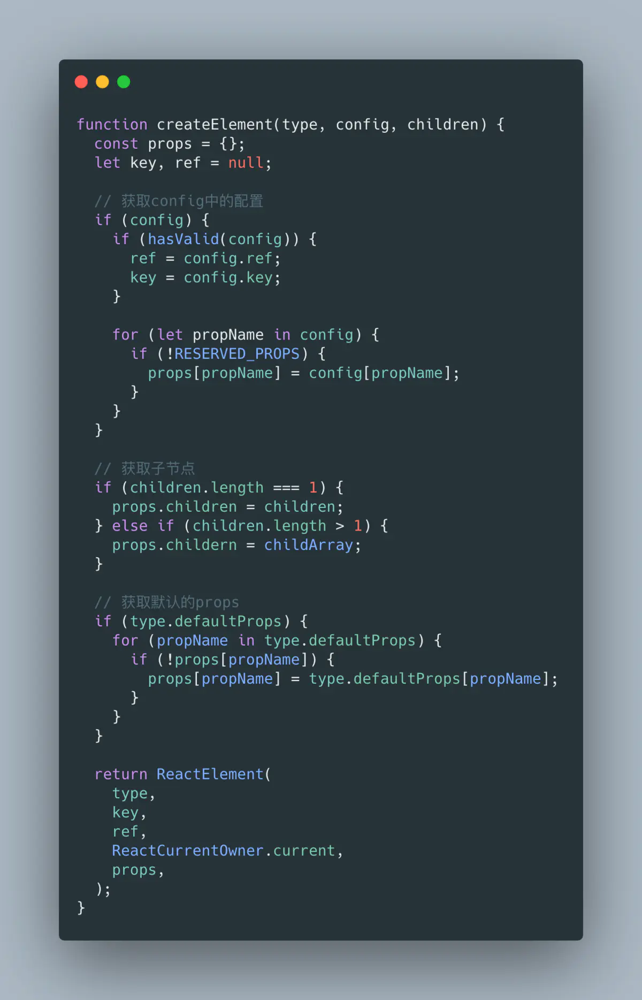
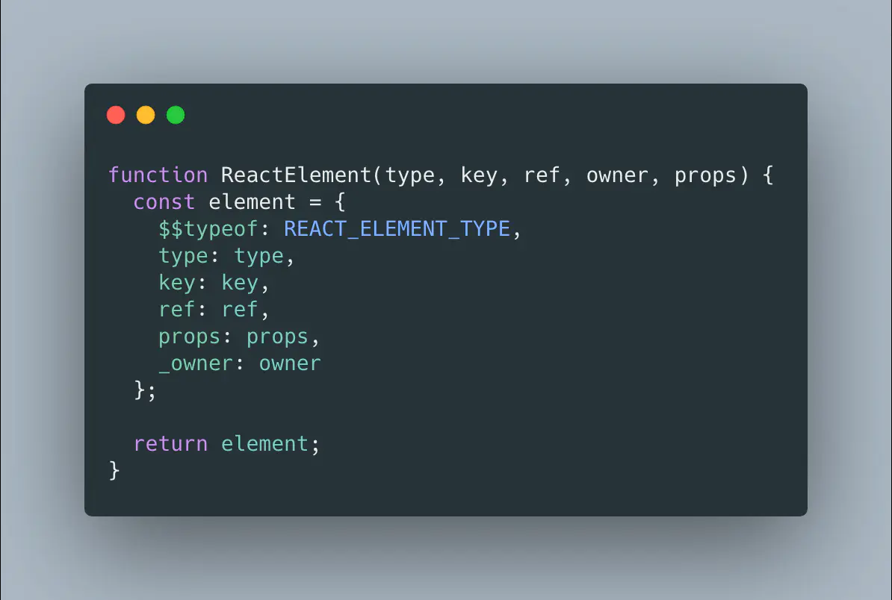

## 第一站: JSX

概念：JSX 是一种类 HTML 动态标签语法，作用是为了能更便捷地使用 JS 构建 UI。

实现原理：所有的 JSX 都会被 babel-plugin-transform-jsx 插件转换成 React.createElement 函数。


React 17 新特性：React 17 版本中使用 JSX 已经不需要手动导入 React。


React.createElement 简化版：



ReactElement 简化版：



## 第二站: 虚拟 DOM

概念：虚拟 DOM 是 JS 对象对真实 DOM 的抽象。

实现原理：React.createElement 会将 JSX 转换为 虚拟 DOM。

虚拟 DOM 的优缺点：优点提升了框架的跨平台能力，缺点是性能上限会变低。


## 第三站: Diff 算法

传统 Diff 算法：时间复杂度是`O(n^3)`。

#### React 中 Diff 算法的策略

1. 同层比对策略

因为在实际开发中改变一个节点的从属关系的情况是很少的，所以 React 只做同层级的比对，忽略跨层级的比对。

时间复杂度：从`O(n^3)`优化至`O(n^2)`

2. 唯一标识策略

因为同层级比对伴随着很多新增删除操作，所以 React 引入 key 作为节点的唯一标识用于复用组件。

时间复杂度：从`O(n^2)`优化至`O(n)`

3. 组件模式策略

因为 Diff 算法需要从根节点开始，逐层遍历以确定目标节点，所以 React 推荐组件化开发用于缩小上述查找过程。

#### React 中 Diff 算法的实现原理

对于新旧节点是非同类型节点时，直接创建新节点再替换旧节点。

对于新旧节点是同类型节点时，在旧节点的基础上更新差异。


针对上述同类型节点的更新差异过程，可以分为属性比对和列表比对

列表比对的实现：

列表比对中运用了两端比对算法 + Key 值比对，具体流程如下：

1. 优先从新旧列表的两端的四个节点开始进行两两比对。
   - 如果存在匹配，则移动并更新节点。
2. 如果第一步均不匹配，则尝试 key 值比对。
   - 如果 key 值匹配，则移动并更新节点。
   - 如果 key 值不匹配，则在对应的位置上新增新节点。

#### Diff 算法可视化

从旧列表`[A, B, C, D, E]`更新到新列表`[F, C, B, D, A]`的步骤如下：

第一轮：


第二轮：


第三轮：


第四、五轮：


## 第四站: Fiber

为什么需要 Fiber？：在之前的 Stack 调度算法中，React 需要实例化每个类组件，生成一颗组件树，使用同步递归的方式进行遍历渲染，而这个过程最大的问题就是无法暂停和恢复。

概念：Fiber 是一种任务分割调度算法，主要是将原先同步更新渲染的任务分割成一个个独立的小任务单位，根据不同的优先级，将小任务分散到浏览器的空闲时间执行，充分利用主进程的事件循环机制。

Fiber 与浏览器的核心交互流程如下：


#### Fiber 的工作流程

Fiber 将更新过程被分为调和阶段与提交阶段。

调和阶段的作用是配合 Diff 算法生成 Fiber 树，此阶段中低优先级任务会随时被高优先级任务所打断，从而导致任务被重复处理，进而造成调和阶段的生命周期函数重复触发。

提交阶段的作用是根据 Fiber 树批量更新节点，此阶段不会被打断。


#### Fiber 对现有代码的影响

由于调和阶段中的生命周期存在重复触发问题，现版本中使用需要加上`UNSAFE_`前缀。

> [Fiber 与 Stack 的对比 Demo](https://claudiopro.github.io/react-fiber-vs-stack-demo/)

## 第五站: Render

将虚拟 DOM 转换成真实 DOM 并挂载到父节点中。

#### 依赖注入式的更新机制

<!-- TODO: 需要深入 -->

对于类组件：在创建时添加 updater 字段，在 setState 时调用。

```js
// 简化版
setState(partialState, callback) {
   // ...
  this.updater.enqueueSetState(this, partialState, callback);
}
```

对于函数组件：在创建时添加 `__currentDispatcher` 字段，在 useState 时调用。

```js
// 简化版
const React = {
  __currentDispatcher: null,
  useState(initialState) {
    return React.__currentDispatcher.useState(initialState);
  },
  useEffect(initialState) {
    return React.__currentDispatcher.useEffect(initialState);
  }
  // ...
};
```
